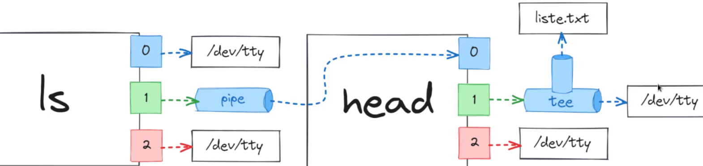

# Linux Commands

## Top Commands

__`ln [TARGET_PATH] [LINK_PATH]` ->__ Create symbolic links (shortcuts) to other files.

__`unzip [TARGET_PATH]` ->__ Unzip files.

__`ssh` ->__ Secure shell.

__`wget [LINK]` ->__ Direct download files from the internet.

__`alias [VAR_NAME]=[CMD]` ->__ komut için kısa isimde değişken atayabiliriz.

__`rev [FILE_PATH]` ->__ dosya içeriğini ters olarak bastırır.

__`xargs [CMD]` ->__ stdin'den girdi kabul etmeyen araçlara(`[CMD]`) girdi gönderebilmek için kullanılır.

- example for `chmod`:
	The permission mask is a three-digit octal number, where each digit represents the permissions for a level (owner, group, others). Each digit is calculated by adding the values of the relevant permissions:
	- 4: Read
	- 2: Write
	- 1: Execute
	For example, 755 represents:
	- Owner: Read, Write, Execute (4 + 2 + 1)
	- Group: Read, Execute (4 + 1)
	- Others: Read, Execute (4 + 1)

__`chown [USERNAME] [FILE_PATH]` ->__ Changes owner of file.

__`du [TARGET_PATH]` ->__ Shows disk usages per file in the target path.

__`wc [FILE_PATH]` ->__ Prints the number of line/word/character of the target file according to the entered option.

__`sed -i 's/OLD_WORD/NEW_WORD/g' [FILE_PATH]` ->__ Replaces the new word with all the old word of the target file.

__`tr old_chars new_chars [INPUT]` ->__ eski karakterleri yenileri ile değiştirir. 

__`uname -a` ->__ sistem bilgisini gösterir.
## File Management

__`less [FILE_PATH]` ->__ When you want to view a file that is longer than one screen, you can use either the `less` utility or the more utility.

__`head -n [COUNT] [FILE_PATH]` ->__ By default the `head` utility displays the first 10 lines of a file.

__`tail -n [COUNT] [FILE_PATH]` ->__ By default `tail` will show the last 10 lines of the file.

__`tail -f [FILE_PATH]` ->__ To continuously monitor the incoming log messages into `FILE_PATH` file in runtime.

__`find [PATH] [OPTIONS] [FILE_NAME]` ->__ `find` command will search for file or directory based on the OPTIONS provided.

__`which [COMMAND_NAME]` ->__`which` will print the full path of the provided `PROGRAMNAME` on `STDOUT`  It does this by searching for an executable or script in the directories listed in the environment variable `PATH`. (example: `which ls` -> output: /usr/bin/ls)

__`tee [TARGET_PATH]` ->__ pipe(`|`) yerine (`T`) şeklinde çalışır. Yani hem `TARGET_PATH`'e hem de devamında gelecek olan komuta girdileri iletir. Örn:

## Check User Information

__`who -u` ->__ The `who` utility displays a list of users who are logged in on the local system.

## Check System Information

__`uptime` ->__ The `uptime` utility displays a single line that includes the time of day, the period of time the computer has been running (in days, hours, and minutes), the number of users logged in, and the load average (how busy the system is).

# Keybindings

__`ALT + A` ->__ terminalde bulunduğumuz satırda en başa yönlendirir.

__`ALT + E` ->__ terminalde bulunduğumuz satırda en sona yönlendirir.

__`ALT + B` ->__ terminalde bulunduğumuz satırda bir kelime geri gider.

__`ALT + F` ->__ terminalde bulunduğumuz satırda bir kelime ileri gider.

__`CTRL + XX` ->__ terminalde bulunduğumuz satırda en başa yönlendirir, tekrar basarsak önceki konuma yönlendirir.

__`ALT + BACKSPACE` ->__ terminalde bulunduğumuz satırda bir kelimeyi siler.

__`ALT + D` ->__ terminalde bulunduğumuz satırda imlecin sağındaki kelimeyi siler.

__`CTRL + W` ->__ terminalde bulunduğumuz satırda imlecin durduğu kelimeyi keser.

__`CTRL + Y` ->__ terminalde bulunduğumuz satırda imlecin durduğu yere kesilen kelimeyi yapıştırır.

# Linux File Hierarchy

__`/bin` ->__ binary/çalıştırılabilir dosyaları tutar.

__`/sbin` ->__ system binaries.

__`/boot` ->__ sistem başlangıcı config dosyalarının olduğu yer.

__`/dev` ->__ sisteme bağlı olan tüm aygıtları dosya gibi tutulduğu yer.

__`/etc` ->__ sistemle ilgili config dosyalarının olduğu yer.

__`/home` ->__ kullanıcıların kişisel dosyalarının barındırıldığı yer.

__`/mnt` ->__ disk aygıtlarının tutulduğu bölüm.

__`/lib` ->__ sistemdeki araçların ortak kütüphanelerini barındırır.

__`/tmp` ->__ geçici dosyaların tutulduğu dizin.

__`/media` ->__ çıkartılabilir medya aygıtlarının tutulduğu bölüm.

__`/opt` ->__ sisteme yüklenen harici uygulamalar kendi kütüphanelerini veya config dosyalarını bu dizinde tutabiliyor.

__`/proc` ->__ şu anki process'leri dosya şeklinde gösterir.

__`/root` ->__ root kullanıcısının ev dizini.

__`/run` ->__ sistem açıldığından itibaren çalışan araçların üretmiş olduğu bilgiler.

__`/srv` ->__ server(hizmetler)'in çeşitli dosyalarının bulunduğu yer.

__`/sys` ->__ sistem üzerindeki sürücüler ve modüller ile ilgili bilgilerin bulunduğu dizin.

__`/usr` ->__ sistem içinde çalıştırılabilir dosyaları ve bu dosyaların info'larını barındıran geniş çaplı bir dizin.

__`/var` ->__ sürekli değişen dosyaların bulunduğu dizin. (örn: .log dosyaları)

__`/dev/null` ->__ trash can gibi ama içine girdiğimiz verileri hiçliğe gönderiyor.

# Redirects(?)

__`>` ->__ default olarak 1 yani stdout'tur. override işlemi yapar.

__`>>` ->__ default olarak 1 yani stdout'tur. append işlemi yapar.

__`2>` ->__  2 yani stderr'dir.

__`<` ->__ default olarak 0 yani stdin'dir.

__`2&>` ->__ 1 ve 2 yani stdout&stderr'dir. Burada 2 stream'ini 1'e yönlendiriyor.

# Package Management

__dpkg(debian package) ->__ .deb paketleri için

__apt(advanced package tool)__ -> arkada dpkg kullanıyor. eğer aradığımız proje bir repoda varsa otomatik indirir. Ayrıca gereken bağımlılıkları da indirir.

__`dpkg -i [PATH]` ->__  .deb uzantılı paketimizi kurar.

__`dpkg -r [APP_NAME]` ->__  uygulamayı kaldırır. Eğer bağımlılıklar varsa hata verir.

__`dpkg -rP [APP_NAME]` ->__  hem uygulamayı hem de config dosyalarını kaldırmak için kullanılır.

__`dpkg -I [PATH]` ->__  .deb uzantılı paketimiz hakkında bilgiler verir.

__`dpkg -l` ->__  kurulu uygulamaları listeler. Spesifik istiyorsak o paketin ismini verebiliriz.

# Users and Groups

__super user ->__  root kullanıcısına verilen isim.

__system user ->__  sistemdeki araçlar tarafından kullanılan hesaplar. (Tüm araçları user hesabı olmasa da bazı araçların user hesapları vardır.)

__normal user ->__  root tarafından oluşturulan standart hesaplardır.

__sudo ->__ normal kullanıcıların root'muş gibi işlem yapmasını sağlar.

__`adduser [USERNAME]` ->__ yeni kullanıcı oluşturur.

__`useradd -m [USERNAME]` ->__ daha seçenekli `adduser` işlemi fakat her işlemi elle girmek gerekir. (Örn: `-m` ev dizini oluşturmasını söylemek için.)

__`passwd [USERNAME]` ->__ `useradd` komutu ile oluşturduğumuz kullanıcıya şifre verebilmek için. Ayrıca mevcut kullanıcıların şifrelerini değiştirmek için de kullanılır.

__`etc/passwd` ->__ user'ların configlerini içerir.
- Oturum açmayı engellemek için `etc/passwd` dosyasından ilgili kullanıcının shell'lini `/usr/sbin/nologin` veya `/bin/false` olarak değiştirebiliriz. (nologin kullanıcıya giriş yaparken hata verir fakat false hiçbir şey yazdırmaz.)

__`etc/shadow` ->__ kullanıcı parolalarının şifrelenmiş halini tutar.

__`userdel [USERNAME]` ->__ kullanıcı siler.

__`deluser [USERNAME]` ->__ kullanıcı siler.

Her kullanıcın bir ana grubu ve çokça alt grubu olabilir. Mesela `sudo` komutuyla komutları yetkili bir şekilde kullanabilmek için sudo grubunda bulunmalıdır.

__`etc/group` ->__ grupların config dosyası.

__`groupadd [GROUP_NAME]` ->__ yeni grup oluşturmak için kullanılır.

__`gpasswd -a [USERNAME] [GROUP_NAME]` ->__ gruba yeni kullanıcı eklemek için kullanılır.

__`gpasswd -d [USERNAME] [GROUP_NAME]` ->__ gruptan kullanıcıyı silmek için kullanılır.

__`groups [USERNAME]` ->__ kullanıcının gruplarını listeler.

__`groupdel [GROUP_NAME]` ->__ grubu silmek için kullanılır.

- `ls -l`'deki `rwxr-xr--` gibi bilgilerin ilk 3'lüsü kullanıcın ortadaki 3'lüsü grubun sondaki 3'lüsü de  grup dışında kalan kullanıcıların yetkileridir.

__`chmod u+r [FILE_NAME]` ->__ kullanıcıya okuma yetkisi verir.

__`chmod g+r [FILE_NAME]` ->__ gruba okuma yetkisi verir.

__`chmod o+r [FILE_NAME]` ->__ diğer kullanıcılara okuma yetkisi verir.

__`chmod a+r [FILE_NAME]` ->__ tüm kullanıcılara okuma yetkisi verir.

__visudo ->__ `sudoer` dosyası için özel bir editör

__`etc/sudoer.tmp` ->__ sudo config dosyası. 

# Disk Management
- diskler `/dev/` altında bulunur. Çünkü diskler de bir byte akışı olduğundan file olarak tutulur.

__`lsblk` ->__ disk üzerindeki blokları listeler.

__`lsblk -f` ->__ diski ve file system'ini gösterir.

__`fdisk -l` ->__ sisteme bağlı tüm diskleri listeler.

__`fdisk [DISK_FILE_PATH]` ->__ disk bölümleme aracına giriş yaparız.

__`mkfs.[FILE_SYSTEM]` ->__ bölümlediğimiz diske file system eklemek için. bir sürü araç olduğundan `mkfs.` girip spesifik olanı bulmak için tab'a basmamız yeterli.

__`mount [DISK_PATH] [TARGET_PATH]` ->__ disk'e file system atamak için ilk önce bir dizine bağlamamız yeterli. Bu tool da bağlamaya yarar. mount'la bağladığımız diskler ve klasör kalıcı değildir. Yani bağlanan klasör yeniden başlatıldıktan sonra eski haline döner. Bağlantıyı kalıcı yapmak için `/etc/fstab` isimli config dosyasını configure etmek gerekir.

__`umount [FILE_PATH_ATTACHED_TO_DISK]` ->__ bağlantıyı koparmamızı sağlar.

# Process Management
- Mesela firefox'u arka planda çalıştırdığımızda `[1] 32349` gibi bir çıktı alırız. parantez içindeki bash kabuğundaki işin id'si iken diğer sayı bilgisayarda çalışan işlem olarak id'yi verir.

__`jobs` ->__ çalışan bash'teki arka plandaki işleri gösterir.

__`fg [APP_BASH_ID]` ->__ arka planda çalışan işi öne alır.

__`bg [APP_BASH_ID]` ->__ önde çalışan işi arka plana atar.

__`kill %[APP_BASH_ID]` ->__ ilgili id'li işlemi sonlandırır.

__`disown %[APP_BASH_ID]` ->__ bash, ilgili id'deki işlemi kendi işlerinden çıkarır. Böylece bash'i kapattığımızda o işlem hala aktif kalır.

__`top` ->__ Anlık olarak çalışan işlemleri gösterir.

__`htop` ->__ `top`'tan daha gelişmiş bir işlem görüntüleyici.

__`ps -aux` ->__ sadece bir kez işlemleri detaylı bir şekilde bastırır.

__`kill -19 [PROCESS_ID]` ->__ işlemi durdurur.

__`kill -18 [PROCESS_ID]` ->__ işlemi devam ettirir.

__`kill -9 [PROCESS_ID]` ->__ force kill atar.

__`kill -15 [PROCESS_ID]` ->__ terminate etmeye zorlar.

__`killall [PROCESS_NAME]` ->__ isme göre işlemi sonlandırır.

__`pgrep [TEXT]` ->__ grep'in process'ler için olan hali.

# Service Management
- Servisler daemon olarak geçiyor.
- yaygın olarak servisler için `systemd` kullanılır. Yönetebilmek için de `systemctl` kullanılır.
- `/etc/systemd/system/` altında servisler tanımlanır.

__`systemctl list-unit` ->__ aktif birimleri listeler.

__`systemctl list-unit --all` ->__ tüm birimleri listeler.

__`systemctl status [UNIT_NAME]` ->__ spesifik bir birimi gösterir.

__`systemctl start [UNIT_NAME]` ->__ adı verilen birimi başlatır.

__`systemctl stop [UNIT_NAME]` ->__ adı verilen birimi sonlandırır.

__`systemctl restart [UNIT_NAME]` ->__ adı verilen servisi yeniden başlatır.

__`systemctl enable [UNIT_NAME]` ->__ adı verilen servisi pc'yi boot'larken başlatılmasını sağlar.

__`systemctl disable [UNIT_NAME]` ->__ adı verilen servisi pc'yi boot'larken başlatılmamasını sağlar.

__`systemctl target add [UNIT_NAME]` ->__ birimleri target gruplarına ekler. (poweroff.target, rescue.target, multi-user.target, graphical.target, reboot.target vb.)

__`systemctl get-default` ->__ varsayılan olan grubu gösterir.

__`systemctl set-default [TARGET_NAME]` ->__ varsayılan grubu değiştirebiliriz.

__`systemctl list-units --type target --all` ->__ tüm target birimlerini listeler.

# About Log Files...
- log dosyaları `/var/log` altında saklanır.

__`dmesg` ->__ Sistemin başlangıcından itibaren çekirdeğin aygıtlarla ilgili üretmiş olduğu tüm log'ları listeler.

__`last` ->__ Başarılı oturum açma işlemlerini listeler.

__`lastb` ->__ Başarısız oturum açma işlemlerini listeler.

# Network Commands
__ttl:__ time to live, yani maksimum yönlendirilme sayısı.
- `/etc/resolv.conf` -> DNS adı tutan adresleri buraya girebiliriz. (Default olarak modem dns'i için 192.168.1..1 bulunur.) Ama bu reboot'tan sonra eski haline döner.

__`ip a` | `ip addr` | `ip address`->__ sisteme bağlı ip adreslerini ve detaylarını gösterir.

__`ip link set [NIC_NAME] [UP/DOWN]` ->__ internet kartının durumunu değiştirebiliriz. (Up: aktif, Down: pasif)

__`ip route` ->__ yönlendirici adreslerini gösterir. (modemi de gösterir çünkü default gateway router'ımız modem.)

__`nmtui` ->__ Network Manager Terminal User Interface 

__`nmcli` ->__ Network Manager Command Line Interface

__`scp` ->__ Secure Copy Protocol: dosyaları güvenli şekilde SSH üzerinden kopyalamamıza yarayan araç.

__`hostnamectl` ->__ host bilgilerini gösterir.

__`nslookup [DOMAIN_NAME]` ->__ ilgili alan adının ip'sini verir.

__`sudo hostnamectl hostname [HOST_NAME]` ->__ hostname'i değiştirmemizi sağlar.  Uygulamaların da tanıyabilmesi için `/etc/hosts`'tan da değiştirilmesi gerekir. (İlk önce config dosyasının değiştirilip ardından `hostnamectl` komutu kullanılmalıdır. Aksi halde hata verir.)

__`arp` ->__ ARP tablosunu gösterir.

__`route` ->__ router bilgilerini gösterir.

__`tarceroute [DOMAIN_NAME/IP]` ->__ bir hedefe ulaşırken geçtiğimiz router'ları gösterir.

__`ss` ->__ sistem üzerindeki soketleri listeler.

__`ss -tuln` ->__ açık olan portları girilen seçeneklerle birlikte gösterilir.